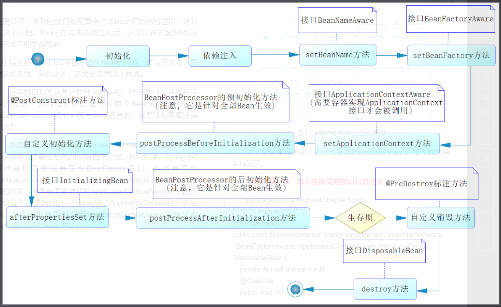

SpringBean初始化流程图->


SpringBean生命周期

-->单个Bean生命周期

```java
package com.example.springboot.damno.chapter2.pojo;

import org.springframework.beans.BeansException;
import org.springframework.beans.factory.*;
import org.springframework.beans.factory.annotation.Autowired;
import org.springframework.beans.factory.annotation.Qualifier;
import org.springframework.context.ApplicationContext;
import org.springframework.context.ApplicationContextAware;
import org.springframework.stereotype.Component;

import javax.annotation.PostConstruct;
import javax.annotation.PreDestroy;

/**
 * mail: love1208tt@foxmail.com
 * Copyright (c) 2018. unnet.missbe
 * Date:  18-11-29 下午7:22
 * @author: lyg
 * description:
 **/
@Component
public class BussinessPerson implements Person, BeanNameAware, BeanFactoryAware,
        ApplicationContextAware, InitializingBean, DisposableBean {
    private User user;

    @Autowired
    @Qualifier("user")
    public void setUser(User user) {
        System.out.println("延迟依赖注入...");
        this.user = user;
    }

    @Override
    public void setBeanFactory(BeanFactory beanFactory) throws BeansException {
        System.out.println("[" + this.getClass().getSimpleName() + "]调用BeanFactory.setBeanFactory");
    }

    @Override
    public void setBeanName(String s) {
        System.out.println("[" + this.getClass().getSimpleName() + "]BeanNameAware.setBeanName");
    }

    @Override
    public void afterPropertiesSet() throws Exception {
        System.out.println("[" + this.getClass().getSimpleName() + "]InitializingBean.afterPropertiesSet");
    }

    @Override
    public void setApplicationContext(ApplicationContext applicationContext) throws BeansException {
        System.out.println("[" + this.getClass().getSimpleName() + "]ApplicationContext.setApplicationContext");
    }

    @Override
    public void destroy() throws Exception {
        System.out.println("[" + this.getClass().getSimpleName() + "]DisposableBean.destroy");

    }

    @PostConstruct
    public void init() {
        System.out.println("[" + this.getClass().getSimpleName() + "]@PostConstruct");

    }

    @PreDestroy
    public void destroyV2() {
        System.out.println("[" + this.getClass().getSimpleName() + "]@PreDestroy");
    }

    @Override
    public void service() {
        System.out.println(user.toString());
    }
}

```

--> BeanPostProcessor对每个Bean都起作用

```java
package com.example.springboot.damno.chapter2.pojo;

import org.springframework.beans.BeansException;
import org.springframework.beans.factory.config.BeanPostProcessor;
import org.springframework.stereotype.Component;

/**
 * mail: love1208tt@foxmail.com
 * Copyright (c) 2018. unnet.missbe
 * Date:  18-11-29 下午7:23
 * @author: lyg
 * description:
 **/
@Component
public class BeanPostProcessorExample implements BeanPostProcessor {
    @Override
    public Object postProcessBeforeInitialization(Object bean, String beanName) throws BeansException {
        System.out.println("BeanPostProcessor调用postProcessBeforeInitialization方法，参数"+
                bean.getClass().getSimpleName() + "-->" + beanName);
        return bean;
    }

    @Override
    public Object postProcessAfterInitialization(Object bean, String beanName) throws BeansException {
        System.out.println("BeanPostProcessor调用postProcessAfterInitialization方法，参数"+
                bean.getClass().getSimpleName() + "-->" + beanName);
        return bean;
    }
}

```

-->Test

```java
package com.example.springboot.damno.chapter2.config;

import com.example.springboot.damno.chapter2.pojo.User;
import com.example.springboot.damno.chapter2.service.UserService;
import org.junit.Test;
import org.slf4j.Logger;
import org.slf4j.LoggerFactory;
import org.springframework.context.ApplicationContext;
import org.springframework.context.annotation.AnnotationConfigApplicationContext;


/**
 * mail: love1208tt@foxmail.com
 * Copyright (c) 2018. unnet.missbe
 * Date:  18-11-29 下午3:30
 * @author: lyg
 * description:
 **/

public class IocTest {
    @Test
    public void testAnnotation(){
        AnnotationConfigApplicationContext ctx = new AnnotationConfigApplicationContext(AppConfig.class);
        ctx.close();
    }
}
```

-->Result

```java
BeanPostProcessor调用postProcessBeforeInitialization方法，参数User-->user
BeanPostProcessor调用postProcessAfterInitialization方法，参数User-->user
19:30:31.530 [main] DEBUG org.springframework.beans.factory.support.DefaultListableBeanFactory - Finished creating instance of bean 'user'
19:30:31.530 [main] DEBUG org.springframework.beans.factory.annotation.AutowiredAnnotationBeanPostProcessor - Autowiring by type from bean name 'bussinessPerson' to bean named 'user'
延迟依赖注入...
[BussinessPerson]BeanNameAware.setBeanName
[BussinessPerson]调用BeanFactory.setBeanFactory
[BussinessPerson]ApplicationContext.setApplicationContext
BeanPostProcessor调用postProcessBeforeInitialization方法，参数BussinessPerson-->bussinessPerson
19:30:31.531 [main] DEBUG org.springframework.context.annotation.CommonAnnotationBeanPostProcessor - Invoking init method on bean 'bussinessPerson': public void com.example.springboot.damno.chapter2.pojo.BussinessPerson.init()
[BussinessPerson]@PostConstruct
19:30:31.531 [main] DEBUG org.springframework.beans.factory.support.DefaultListableBeanFactory - Invoking afterPropertiesSet() on bean with name 'bussinessPerson'
[BussinessPerson]InitializingBean.afterPropertiesSet
BeanPostProcessor调用postProcessAfterInitialization方法，参数BussinessPerson-->bussinessPerson
19:30:31.531 [main] DEBUG org.springframework.beans.factory.support.DefaultListableBeanFactory - Finished creating instance of bean 'bussinessPerson'
19:30:31.531 [main] DEBUG org.springframework.beans.factory.support.DefaultListableBeanFactory - Returning cached instance of singleton bean 'user'
19:30:31.531 [main] DEBUG org.springframework.beans.factory.support.DefaultListableBeanFactory - Creating shared instance of singleton bean 'userService'
19:30:31.531 [main] DEBUG org.springframework.beans.factory.support.DefaultListableBeanFactory - Creating instance of bean 'userService'
19:30:31.531 [main] DEBUG org.springframework.beans.factory.support.DefaultListableBeanFactory - Eagerly caching bean 'userService' to allow for resolving potential circular references
BeanPostProcessor调用postProcessBeforeInitialization方法，参数UserService-->userService
BeanPostProcessor调用postProcessAfterInitialization方法，参数UserService-->userService
19:30:31.533 [main] DEBUG org.springframework.beans.factory.support.DefaultListableBeanFactory - Finished creating instance of bean 'userService'
19:30:31.533 [main] DEBUG org.springframework.beans.factory.support.DefaultListableBeanFactory - Returning cached instance of singleton bean 'org.springframework.context.event.internalEventListenerFactory'
19:30:31.554 [main] DEBUG org.springframework.context.annotation.AnnotationConfigApplicationContext - Unable to locate LifecycleProcessor with name 'lifecycleProcessor': using default [org.springframework.context.support.DefaultLifecycleProcessor@ba2f4ec]
19:30:31.555 [main] DEBUG org.springframework.beans.factory.support.DefaultListableBeanFactory - Returning cached instance of singleton bean 'lifecycleProcessor'
19:30:31.558 [main] DEBUG org.springframework.core.env.PropertySourcesPropertyResolver - Could not find key 'spring.liveBeansView.mbeanDomain' in any property source
19:30:31.560 [main] INFO org.springframework.context.annotation.AnnotationConfigApplicationContext - Closing org.springframework.context.annotation.AnnotationConfigApplicationContext@5f2108b5: startup date [Thu Nov 29 19:30:31 CST 2018]; root of context hierarchy
19:30:31.560 [main] DEBUG org.springframework.beans.factory.support.DefaultListableBeanFactory - Returning cached instance of singleton bean 'lifecycleProcessor'
19:30:31.561 [main] DEBUG org.springframework.beans.factory.support.DefaultListableBeanFactory - Destroying singletons in org.springframework.beans.factory.support.DefaultListableBeanFactory@6d3af739: defining beans [org.springframework.context.annotation.internalConfigurationAnnotationProcessor,org.springframework.context.annotation.internalAutowiredAnnotationProcessor,org.springframework.context.annotation.internalRequiredAnnotationProcessor,org.springframework.context.annotation.internalCommonAnnotationProcessor,org.springframework.context.event.internalEventListenerProcessor,org.springframework.context.event.internalEventListenerFactory,appConfig,DBConfig,indexController,beanPostProcessorExample,bussinessPerson,user,userService]; root of factory hierarchy
19:30:31.561 [main] DEBUG org.springframework.context.annotation.CommonAnnotationBeanPostProcessor - Invoking destroy method on bean 'bussinessPerson': public void com.example.springboot.damno.chapter2.pojo.BussinessPerson.destroyV2()
[BussinessPerson]@PreDestroy
19:30:31.561 [main] DEBUG org.springframework.beans.factory.support.DisposableBeanAdapter - Invoking destroy() on bean with name 'bussinessPerson'
[BussinessPerson]DisposableBean.destroy
```

